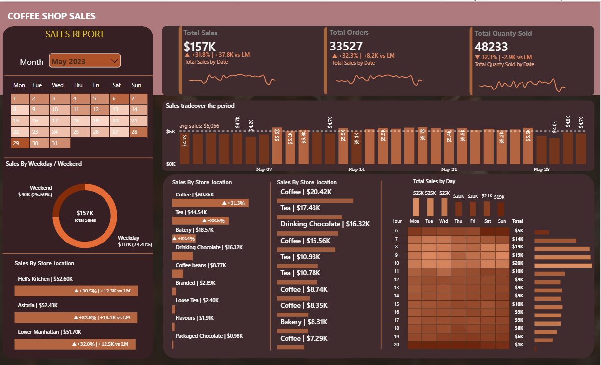

# Coffee Shop Sales Analysis Dashboard

## Project Overview

An interactive Power BI dashboard created to analyze coffee shop sales performance, trends, and patterns.

## Tools Used

- Microsoft Power BI
- Power Query
- DAX

## Dashboard Features

- Total Sales
- Total Orders
- Total Quantity Sold
- Sales trends
- Sales by weekday and weekend
- Sales by store location
- Product sales analysis
- Sales by day and hour
- Month-over-month comparison

## Dashboard Preview

## Key Insights

- Analyzed overall sales, orders, and quantity sold.
- Compared weekday and weekend sales performance.
- Analyzed sales across different store locations.
- Identified product-level sales patterns.
- Examined sales trends by day and hour.
- Compared monthly performance with the previous month.
  
## Project Files

- CF.pbix – Power BI report
- Dashboard.png – Dashboard preview
